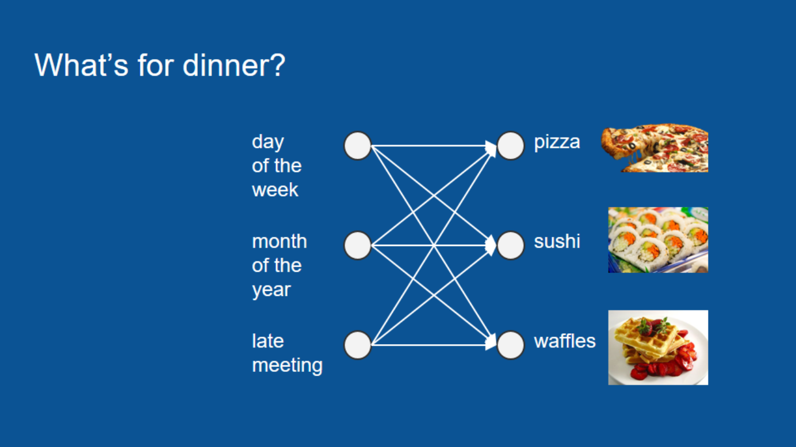
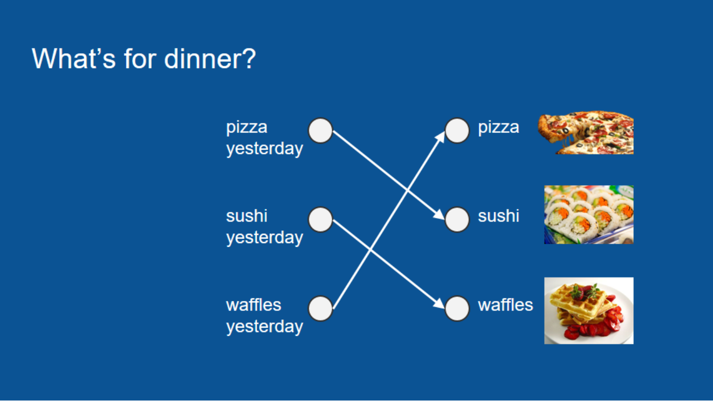
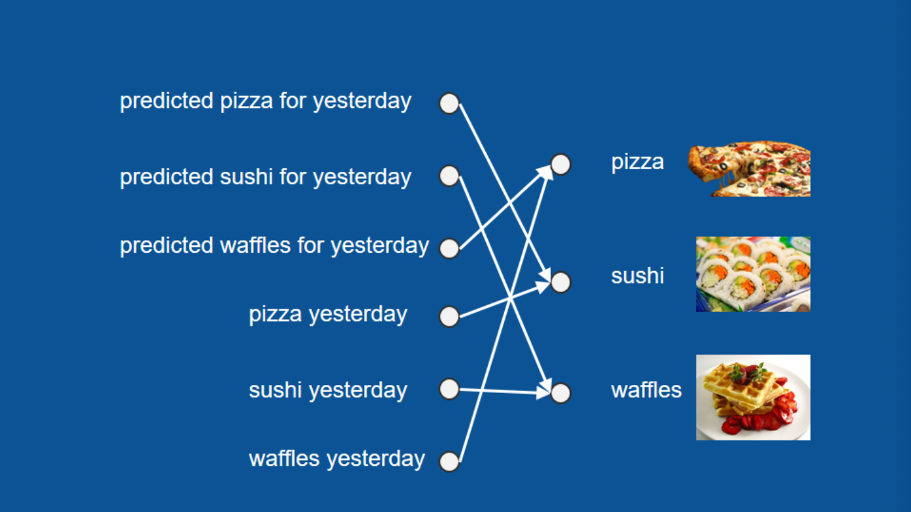

### 專案介紹

「DL_Generated_Lyrics」是一個基於深度學習的歌詞生成工具，利用 LSTM (長短期記憶) 網絡學習和生成具有周杰倫風格的歌詞。

**功能特點**

- **歌詞生成**：根據用戶輸入的seed詞生成連貫的歌詞。
- **靈活的訓練選項**：使用自定義歌詞數據集訓練模型，以適應不同的歌詞風格和語言。
- **深度學習技術**：利用基於 TensorFlow 的 char-rnn-tf 框架，實現有效的文字生成。

**相關技術**

- **TensorFlow**：利用 TensorFlow 框架實現 LSTM 網絡。
- **Python**：主要程式語言。
- **char-rnn-tf**：此專案以 [char-rnn-tf](https://github.com/hit-computer/char-rnn-tf) 為基礎，該項目支援多種語言的字符級文本生成。

**訓練資料**

- 此專案使用了他人整理好的周杰倫的歌詞，但是歌詞內容為簡體中文，訓練資料約六千多行，不影響生成的內容，但是這樣訓練的話，發現訓練資料還是太少，若有更多的訓練資料，應該生成的內容會更加精準貼切。

### LSTM Algorithm介紹

演算法為”LSTM”，相關易懂內容如下：（引用自[這篇文章](https://brohrer.mcknote.com/zh-Hant/how_machine_learning_works/how_rnns_lstm_work.html)）

這幾年，機器學習（machine learning）相關的應用獲得了許多關注，其中有幾大領域特別熱門：其中一個是圖片辨識，像是在網路上搜尋貓咪的圖片，或是將任何問題轉為類似形式；另一個則是序列到序列翻譯（sequence to sequence translation），包括將語音轉為文字或翻譯不同語言。前者大多是利用卷積神經網路（CNN）所完成，後者則多利用遞歸神經網路（RNN），尤其是長短期記憶模型（LSTM）。

為了理解 LSTM 的運作原理，我們可以考慮一下「晚餐要吃什麼」這個問題：假設讀者住在公寓，很幸運地有個愛煮晚餐的室友。每天晚上室友都會準備壽司、鬆餅或披薩，而你希望能預測某個晚上你會吃什麼，並藉此規劃其他晚餐。為了預測晚餐，讀者建了一個神經網路模型。這個模型的輸入資料包括星期幾、第幾個月、以及室友是否開會開到很晚等會影響晚餐的因素。



如果讀者想先跳過其他文章，又還不清楚神經網路是什麼，可以先把神經網路想成一個投票過程。神經網路裡包含了一個複雜的投票過程，而我們所輸入的資料，如星期幾、第幾個月等等，都會進入這個過程。接著我們可以根據過去的晚餐訓練這個模型，並預測今天的晚餐。

不過，用這種方法訓練的模型，表現並不是很好。就算我們謹慎挑選輸入資料並訓練模型，它的表現還是沒有比隨機猜測好上多少。

和其他複雜的機器學習問題一樣，先退一步回顧資料，可以幫助我們找出其中的規律。於是我們發現，原來室友在做完披薩後的隔天會準備壽司，再隔一天會準備鬆餅，然後又回去做披薩，就這樣持續下去。由於這個循環很普通，跟星期幾沒什麼關係，我們可以根據這項特徵訓練一個新的神經網路模型。

在這個新的模型裡，唯一重要的因素只有昨天吃過的晚餐，所以如果昨天吃披薩，今天就會吃壽司；昨天吃壽司，今天吃鬆餅；昨天吃鬆餅，今天吃披薩。整個投票過程變得非常簡單，預測也很準確，因為你的室友做事非常連貫。


現在考慮另一個情況：如果讀者有某一晚不在家，像是昨天晚上出門了，那就無從得知昨天晚餐吃什麼。不過，我們還是能從幾天前的晚餐推測今天會吃什麼——只要先從更早之前推回昨天的晚餐，就能接著預測今天的晚餐。

總之，我們不只能利用昨晚實際吃什麼，也能利用昨晚的預測結果。


# 環境安裝

```
$ pip install -r requirements.txt

$ mkdir model
```

# 訓練

```
$ python train.py path_to_your_corpus.txt

$ python train.py lyrics/all_training_lyrics.txt
```

# 產生歌詞

```
$ python generate.py "start sentence"

$ python generate.py "還記得你說家是唯一的城堡"
```